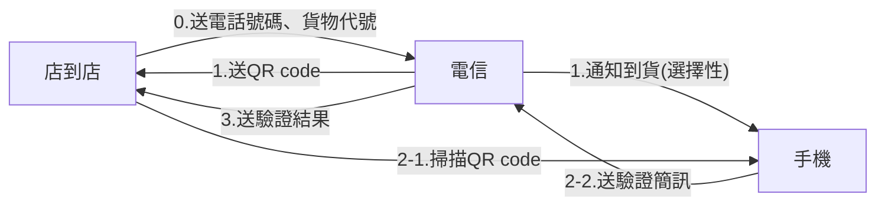

# pcs-final-project
Simple idea on verifying the identity with PCS.

```mermaid
flowchart LR;
    company["店到店"];
    telecom["電信"];
    phone["手機"];
    company-->|"0.送電話號碼、貨物代號"| telecom;
    telecom-->|"1.送QR code"| company;
    telecom-->|"3.送驗證結果"| company;
    telecom-->|"1.通知到貨(選擇性)"| phone;
    company-->|"2-1.掃描QR code"| phone;
    phone-->|"2-2.送驗證簡訊"| telecom;
```
