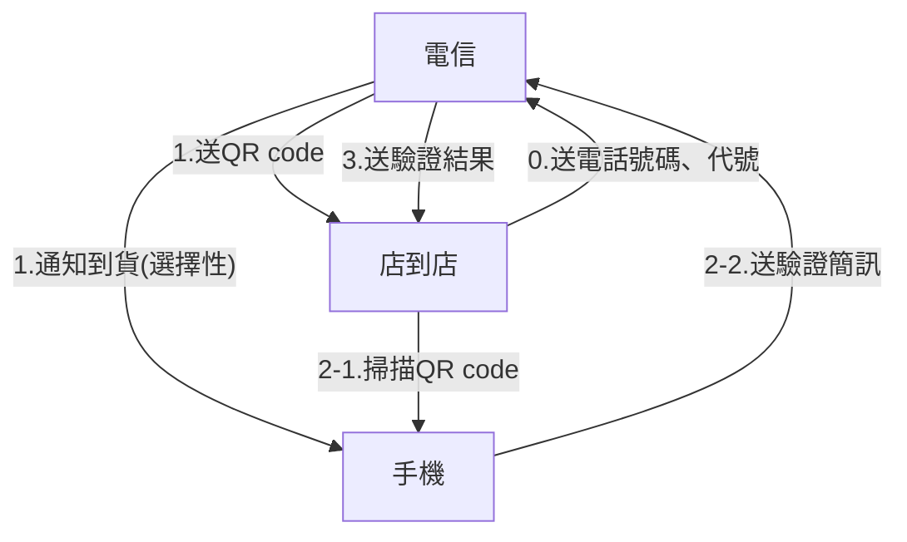
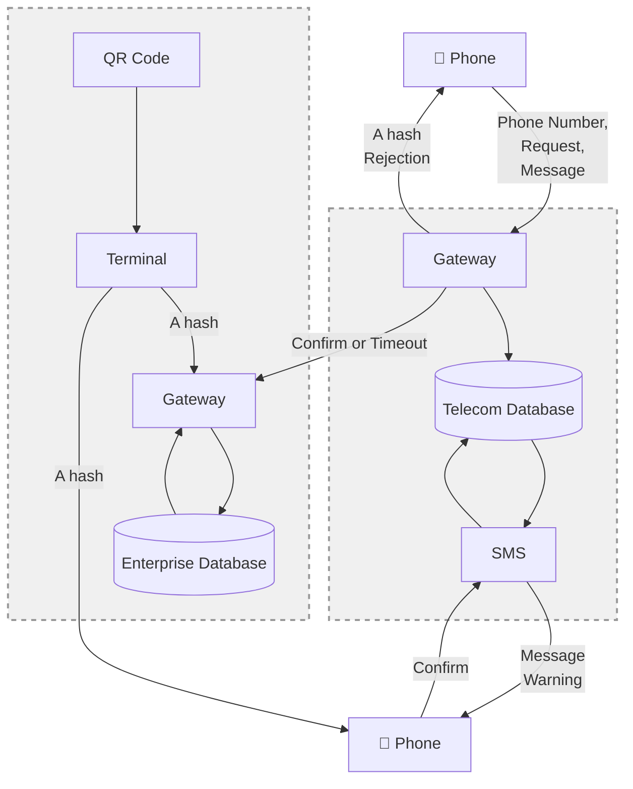
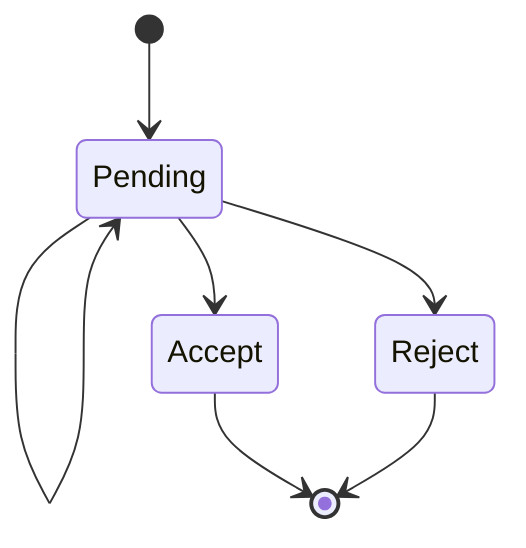
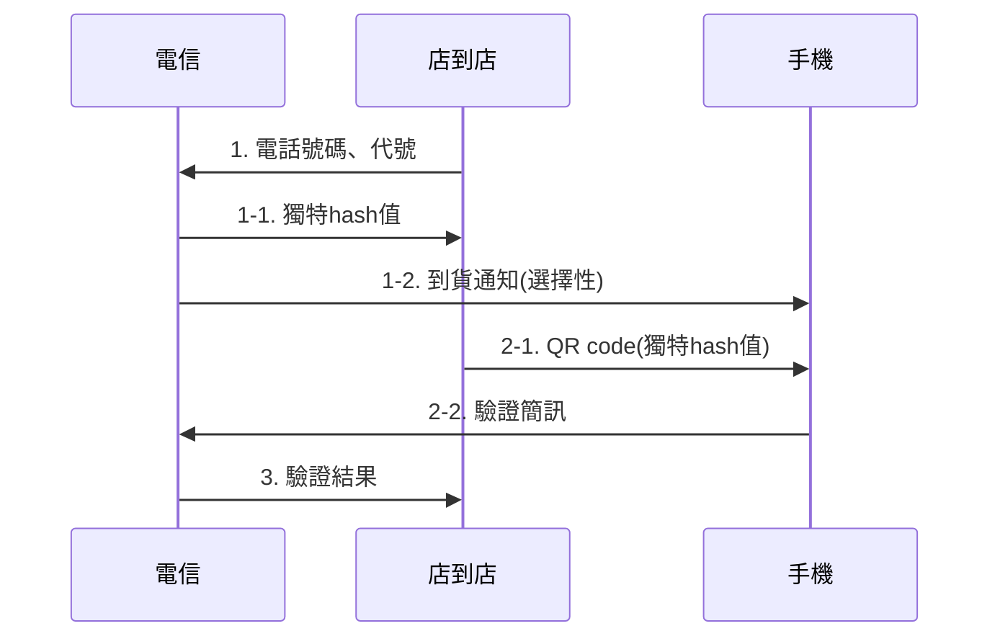

# pcs-final-project
Simple idea on verifying the identity with PCS.

## Architecture

```mermaid
flowchart TB
    telecom["電信"]
    company["店到店"]
    phone["手機"]
    company-->|"0.送電話號碼、代號"| telecom
    telecom-->|"1.送QR code"| company
    telecom-->|"3.送驗證結果"| company
    telecom-->|"1.通知到貨(選擇性)"| phone
    company-->|"2-1.掃描QR code"| phone
    phone-->|"2-2.送驗證簡訊"| telecom
```

```mermaid
flowchart TB
    Phone1[📱 Phone]
    
    subgraph Cloud1[" "]
        GW1[Gateway]
        TelecomDB[(Telecom Database)]
        SMS[SMS]
    end
    
    subgraph Cloud2[" "]
        GW2[Gateway]
        EnterpriseDB[(Enterprise Database)]
        Terminal[Terminal]
        QR[QR Code]
    end
    
    Phone2[📱 Phone]
    
    Phone1 -->|Phone Number,<br/>Request,<br/>Message| GW1
    GW1 -->|A hash<br/>Rejection| Phone1
    GW1 --> TelecomDB
    TelecomDB --> SMS
    SMS --> TelecomDB
    
    GW1 -->|Confirm or Timeout| GW2
    
    GW2 --> EnterpriseDB
    EnterpriseDB --> GW2
    
    Terminal -->|A hash| GW2
    QR --> Terminal
    
    SMS -->|Message<br/>Warning| Phone2
    Phone2 -->|Confirm| SMS
    
    Terminal -->|A hash| Phone2
    
    style Cloud1 fill:#f0f0f0,stroke:#999,stroke-width:2px,stroke-dasharray: 5 5
    style Cloud2 fill:#f0f0f0,stroke:#999,stroke-width:2px,stroke-dasharray: 5 5
```

## State Machine of SMS

```mermaid
stateDiagram-v2
[*] --> Pending
Pending --> Pending
Pending --> Accept
Pending --> Reject
Accept --> [*]
Reject --> [*]
```

## The Flow

```mermaid
sequenceDiagram
participant telecom as 電信
participant company as 店到店
participant phone as 手機
company->>telecom: 1. 電話號碼、代號
telecom->>company: 1-1. 獨特hash值
telecom->>phone: 1-2. 到貨通知(選擇性)
company->>phone: 2-1. QR code(獨特hash值)
phone->>telecom: 2-2. 驗證簡訊
telecom->>company: 3. 驗證結果
```
